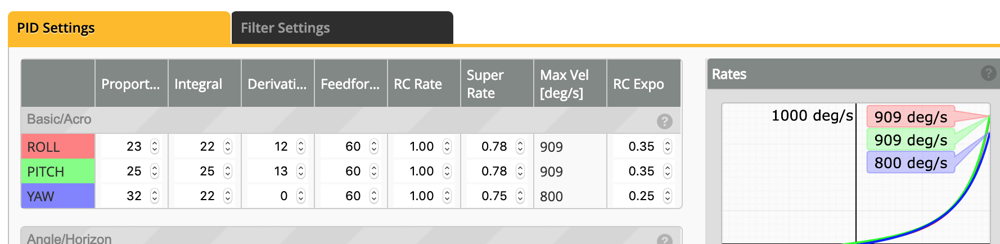

# Betaflight Setup

## Setup

- Verify orientation by moving quad and ensuring model on screen moves accordingly. 

## Ports

- Configure Smart Audio (if available)

- Configure GPS (if available

## Configuration

- **ESC/Motor Features**: set to at least `DSHOT 600` (DSHOT1200/2400 if hardware allows).

- **Receiver**: Set `Serial-based receiver`; `SBUS`.

- **Other Features**: 

    - LED (optional)

    - Airmode

    - OSD

    - Anti-Gravity

    - Dynamic_Filter

    - DSHOT Beacon
        - Set `Beacon Tone`
        - Set `RX_Lost`
        - Set `RX_SET`
        - Configure beeper configuration as needed

## Power & Battery

### Battery

- **Voltage Meter Source**: Onboard ADC

- **Current Meter Source**: Onboard ADC; unless other source available - I.E. current shunt, ESC current sensor.

## PID Tuning

## Receiver

- **Set Channel map**

- **Set RSSI Channel**: typically channel 2.

## Modes

Set:

- Arm
- Beeper
- Flip over crash
- Prearm

## Motors

- Use to test motor direction and correct motor spinning. 

## OSD

Configure:

- RSSI

- Main battery voltage

- Timer 2 (actual flight time)

- Throttle position

## Blackbox

## CLI
