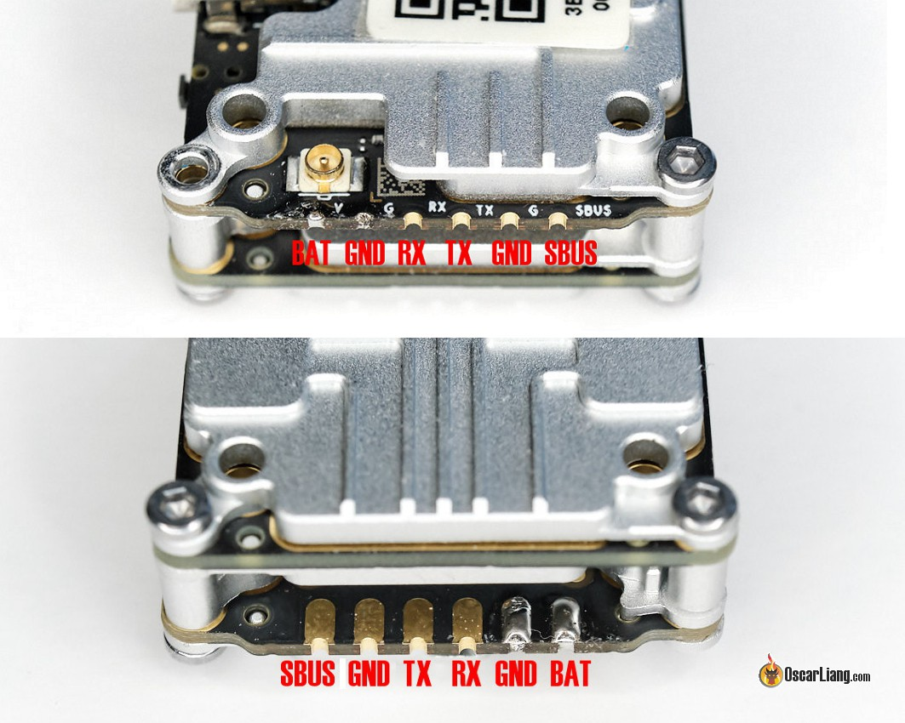

# Current Hardware

- [Flight Controllers](#flight-controllers)
    - [KISS ULtra](#kiss-ultra)
    - [Kiss v2 Flight Controller](#kiss-v2-flight-controller)
    - [Iflight Beast F7](#iflight-beast-f7)
- [Electronic Speed Controllers](#electronic-speed-controllers)
    - [KISS 25a 4in1 ESC](#kiss-25a-4in1-esc)
    - [Hobbywing 60A](#hobbywing-60a)
- [Receiver](#receiver)
    - [Crossfire Nano](#crossfire-nano)
- [Video Transmitters](#video-transmitters)

## Flight Controllers

### KISS Ultra

### Kiss v2 Flight Controller

#### Kiss v2 Ports Pinout

#### Wiring Plan

### Iflight Beast F7

## Electronic Speed Controllers

### KISS 25a 4in1 ESC

### Hobbywing 60A

## Receiver

### Crossfire Nano

## Video Transmitters

### Caddx Vista

### TBS Sixty9

