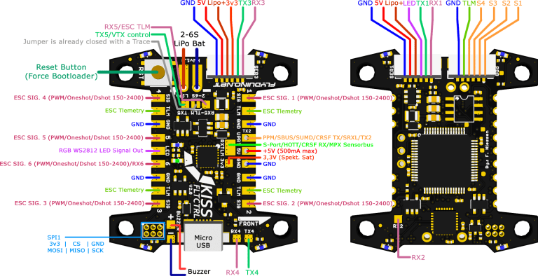
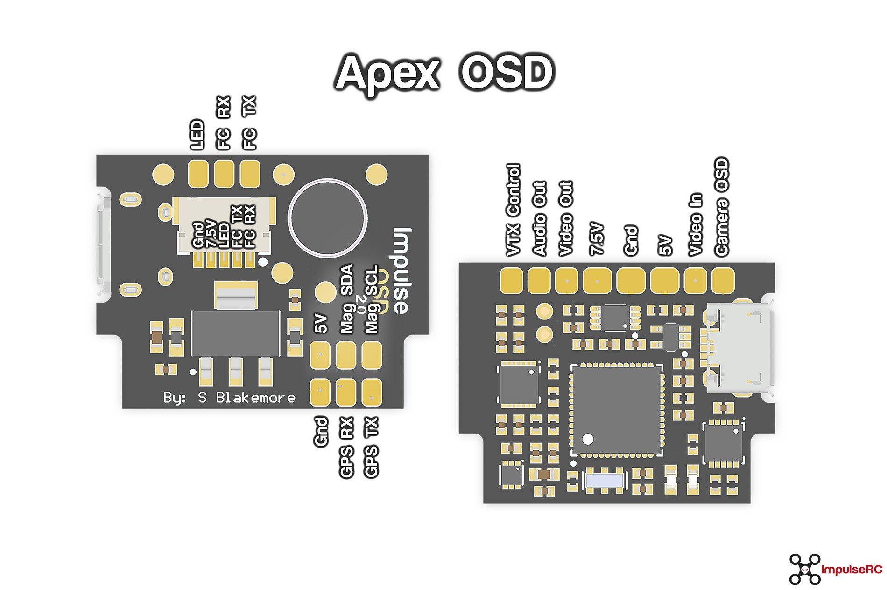
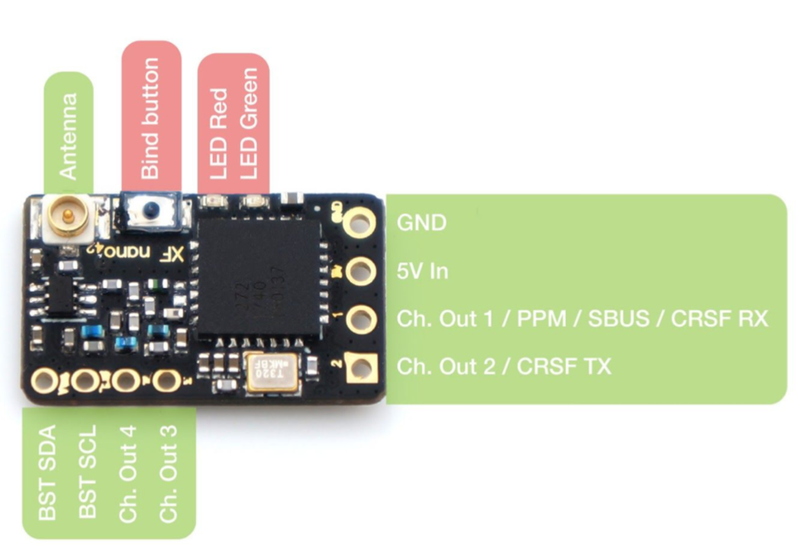

# Wiring Diagrams

## Current Setups

Flight Controllers
- [Fettec Flight Controller](#fettec)
- [Kiss v2](#kiss-v2)
- [Synergy F4](#Synergy-F4)
- [Diatone Mamba 20x20](#diatone-mamba-20x20)

ESC
- [Fettec 35A](#fettec-35a)
- [Kiss 32A](#kiss-32a) 
- [Holybro Tekko32](#holybro-tekko32) 
- [iFlight Succex 45a](#iflight-succex-45a)
- [Diatone Mamba 20x20](#diatone-mamba-20x20)

PDB

- [Wolf PDB](#wolf-pdb)
- [Apex OSD](#apex-osd)
- [Apex Regulator](#apex-regulator)

VTX
- [TBS Unify EVO](#tbs-unify-evo)
  - [Hardware manual](https://www.team-blacksheep.com/tbs-unify-evo-manual.pdf)
- [TBS Unify HV](#tbs-unify-hv)
- [TBS Unify 5v](#tbs-unify-5v)

Receiver
- [Crossfire Nano](#crossfire-nano)

Other
- [Tiny's LEDs](#tiny's-leds-4-led-strip)

---

## Flight Controllers

### Fettec Flight Controller

### Kiss v2

### Synergy F4

### Diatone Mamba 20x20

## ESCs

### Fettec 35A

### KISS 32A 

### Holybro Tekko32

### iFlight Succex 45a

## PDB

### Wolf PDB

### Apex OSD

### Apex Regulator

## VTX

### TBS Unify EVO
- [Hardware manual](https://www.team-blacksheep.com/tbs-unify-evo-manual.pdf)

### TBS Unify HV

### TBS Unify 5v

## Receivers

### Crossfire Nano

- `Ch1=RX`, `Ch2=TX`

## Other

### Tiny's LEDs 4 LED Strip

- `S=IN`, `L=OUT`

