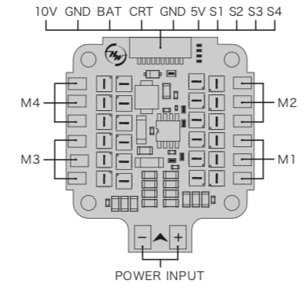
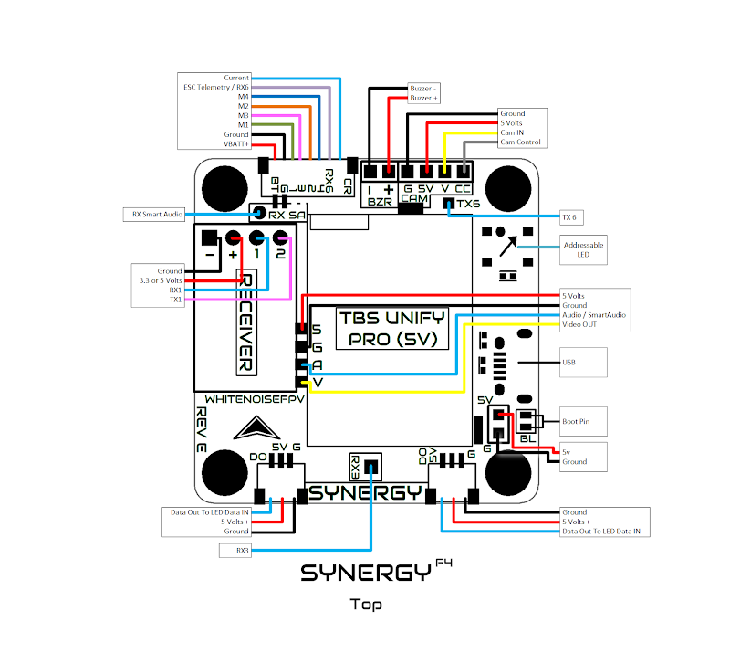

# ESC, FC,  GPS 

[Back to Main](https://dillonreese.github.io/firstpersonview/)

- [ESC](#esc)
    - [Hobbywing 45a ESC](#hobbywing-45a)
    - [Iflight Succex 45a ESC](#iflight-succex-45a)
- [Flight Controllers](#flight-controllers)
    - [BetaFPV 1-2s Flight Controller](#betafpv-1-2s-flight-controller)
    - [BetaFPV AIO v3](#betafpv-aio-v3)
    - [BrainFPV Radix](#brainfpv-radix)
    - [CrazyBee F4 Pro v2 (Frsky)](#crazybee-f4-pro-v2-frsky-)
    - [Synergy F4](#synergy-f4)
- [GPS](#gps)
    - [BN-180](#bn-180)
    - [TBS Ublox M8N](#tbs-ublox-m8n)

---

# ESC

## Hobbywing 45a

## Iflight Succex 45a 

# Flight Controllers

## BetaFPV 1-2s Flight Controller

## BetaFPV AIO v3

## BrainFPV Radix

## CrazyBee F4 Pro v2 (Frsky)

## Synergy F4

# GPS

## BN-180

## TBS Ublox M8N
