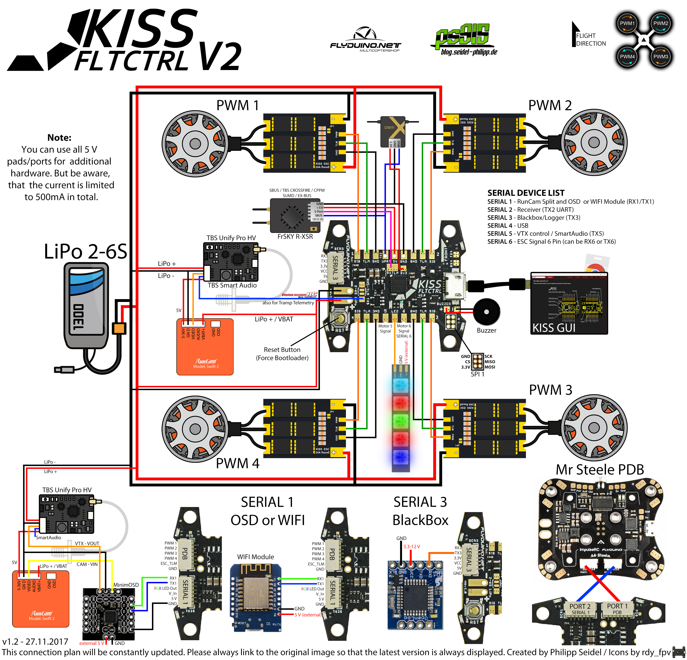

- [ESC](#esc)
    - [KISS Default Motor Order](#kiss-default-motor-order)
    - [KISS 32a ESC](#kiss-32a-esc)
    - [Kiss 25a 4in1 ESC](#kiss-25a-4in1-esc)
- [Flight Controller](#flight-controllers)
    - [KISS v1 Flight Controller](#kiss-v1-flight-controller)
    - [KISS v2 Flight Controller](#kiss-v2-flight-controller)
- [Back to Main](readme.md)
---

## KISS Default Motor Order

# ESC

## KISS 32a ESC

## KISS 25a 4in1 ESC

# Flight Controllers

## Kiss v1 Flight Controller

### KISS v1 Flight Controler Top

### Kiss v1 Flight Controller Ports

## Kiss v2 Flight Controller

### Kiss v2 Ports Pinout

### Wiring Plan

