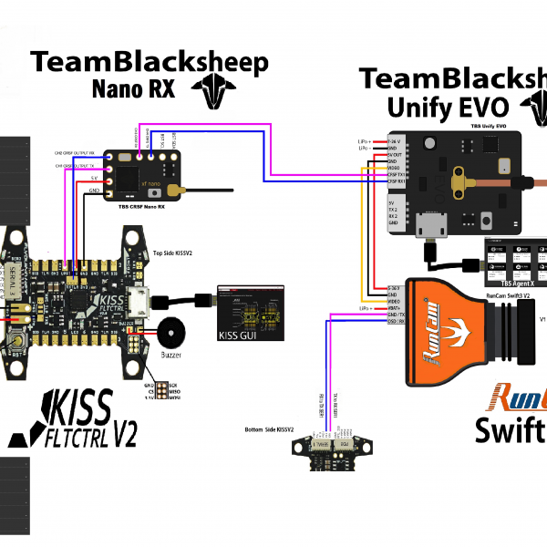
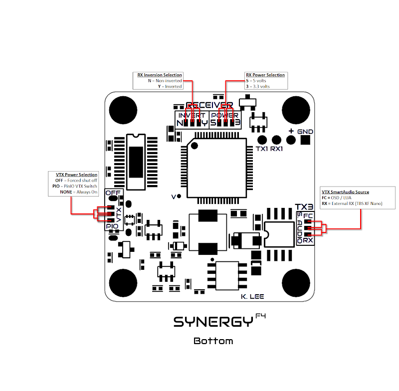
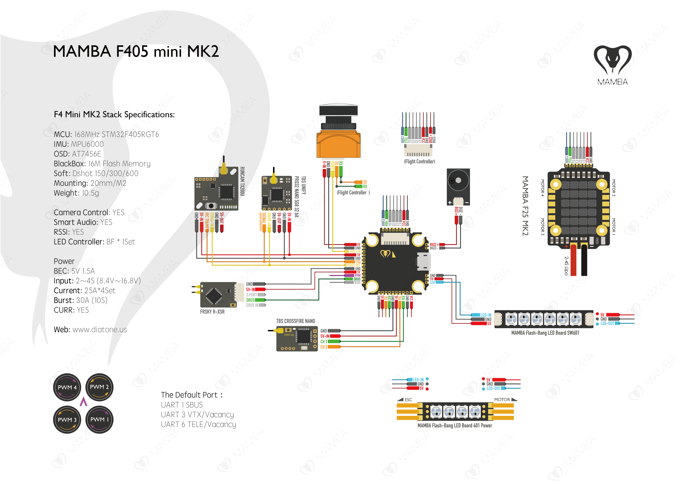
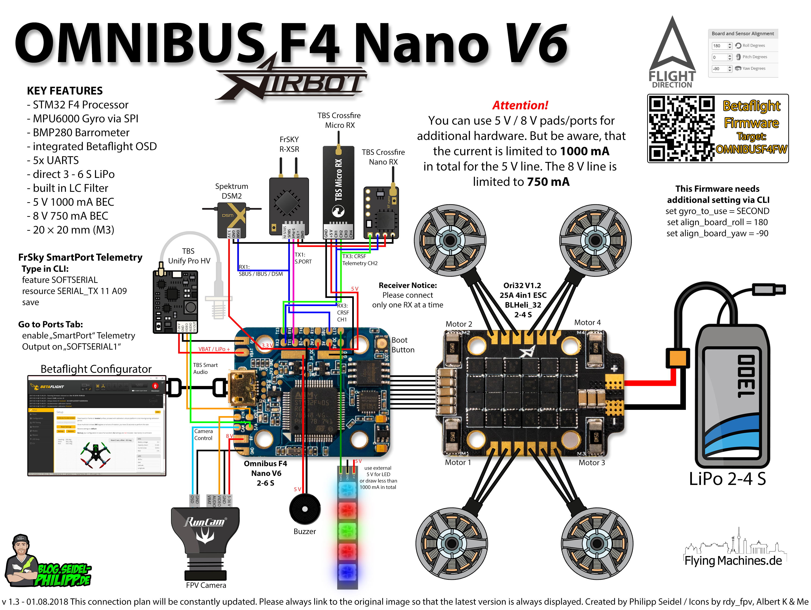
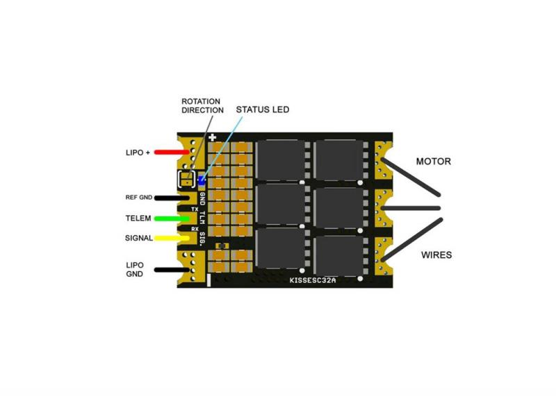
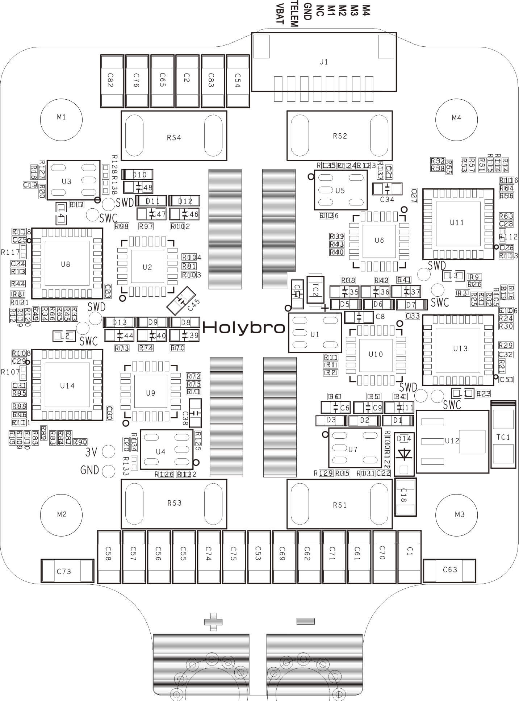
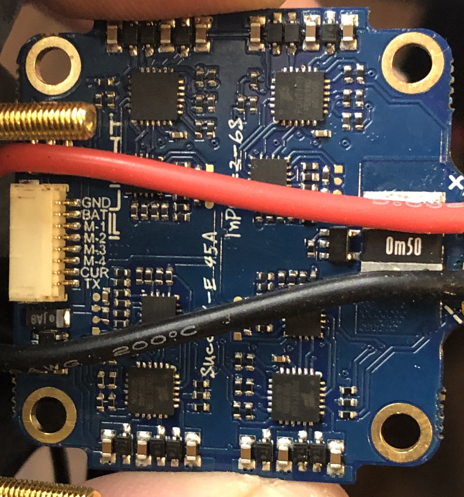
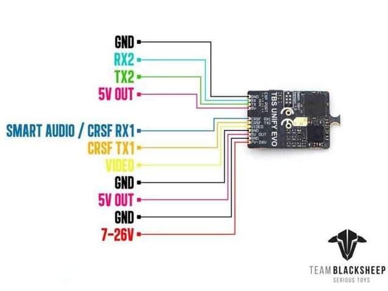
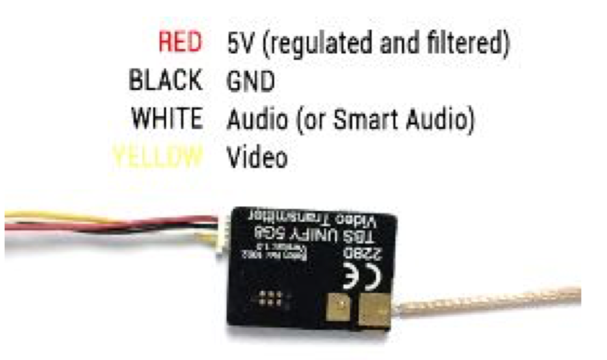
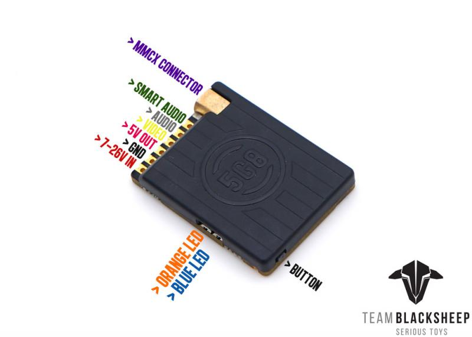

# Wiring Diagrams

## Previous and Current Setups 

Flight Controllers
- [Kiss v1](#kiss-v1)
- [Kiss v2](#kiss-v2)
- [Synergy F4](#Synergy-F4)
- [Helio v2](#helio-v2)
- [Diatone Mamba 20x20](#diatone-mamba-20x20)
- [BrainFPV Radix](#brainfpv-radix)
  - [Hardware Manual](https://www.brainfpv.com/knowledgebase/radix-hardware-manual)
- [Omnibus F4 Nano v6](#omnibus-nano-f4-v6)

ESC
- [Kiss 32A](#kiss-32a) 
- [Holybro Tekko32](#holybro-tekko32) 
- [iFlight Succex 45a](#iflight-succex-45a)
- [Diatone Mamba 20x20](#diatone-mamba-20x20)

PDB

- [Wolf PDB](#wolf-pdb)
- [Apex OSD](#apex-osd)
- [Apex Regulator](#apex-regulator)

VTX
- [TNS Unify EVO](#tbs-unify-evo)
  - [Hardware manual](https://www.team-blacksheep.com/tbs-unify-evo-manual.pdf)
- [TBS Unify HV](#tbs-unify-hv)
- [TBS Unify 5v](#tbs-unify-5v)
- [TBS Unify Race](#tbs-unify-race)
- [AKK Mach3](#akk-mach3)
- [Nameless RC 400](#nameless-rc-400)

Receiver
- [Crossfire Nano](#crossfire-nano)
- [FrSky R9 Mini](#frsky-r9-mini)
- [FrSky R9 Slim+](#frsky-r9-slim)

GPS
- [M8N GLONASS GPS Module](#m8n-glonass-gps-module)

## Flight Controllers

### Kiss v1

_Top_

_Ports_

### Kiss v2

### Synergy F4

### Helio v2

### Diatone Mamba 20x20

### BrainFPV Radix
  - [Hardware Manual](https://www.brainfpv.com/knowledgebase/radix-hardware-manual)

### Omnibus Nano F4 v6

## ESCs

### KISS 32A 

### Holybro Tekko32

### iFlight Succex 45a

# PDB

### Wolf PDB

### Apex OSD

### Apex Regulator

## VTX

### TBS Unify EVO
- [Hardware manual](https://www.team-blacksheep.com/tbs-unify-evo-manual.pdf)

### TBS Unify HV

### TBS Unify 5v

### TBS Unify Race

### AKK Mach3 

### Nameless RC 400

## Receivers

### Crossfire Nano

### FrSky R9 Mini

### FrSky R9 Slim+

## GPS

### M8N GLONASS GPS Module

