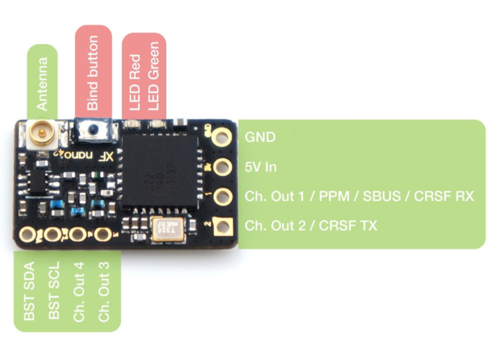
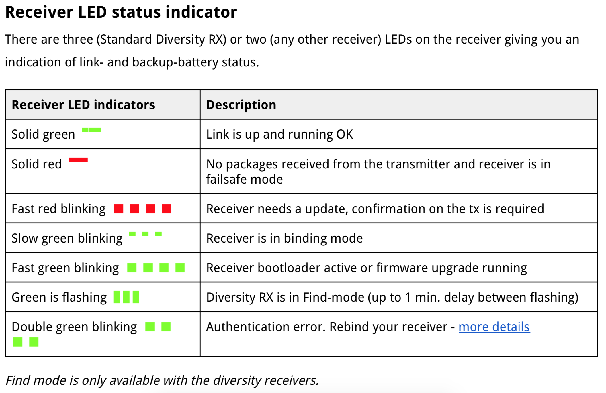
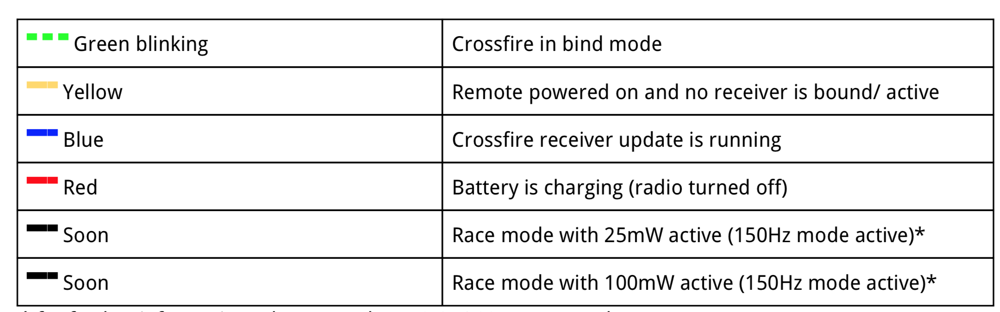
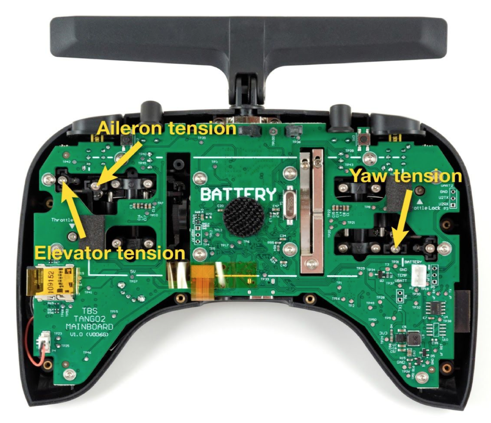
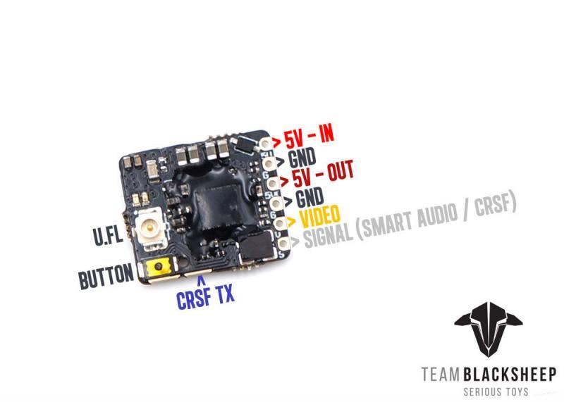
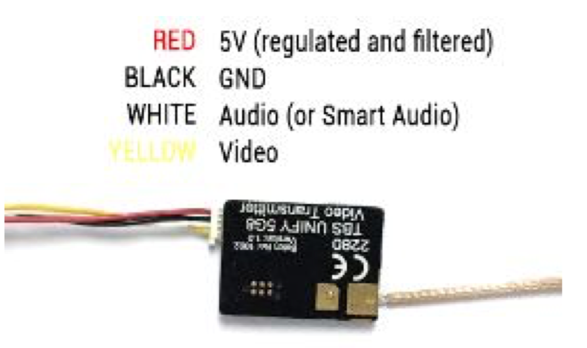
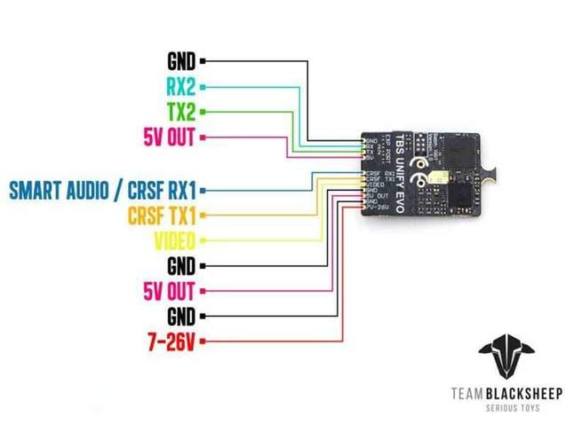
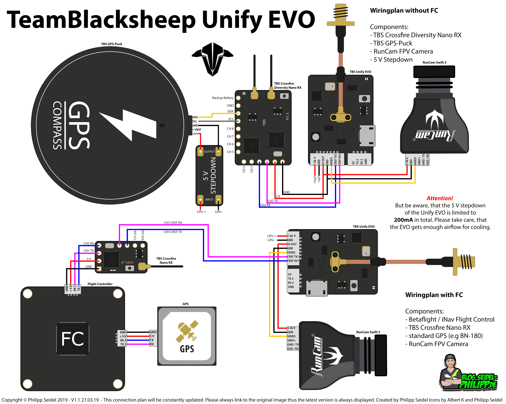

[Back to Main](https://dillonreese.github.io/firstpersonview/)

- [Documentation](#documentation)
- [Crossfire](#crossfire)
    - [Crossfire Nano](#crossfire-nano)
    - [Tango 2](#tango-2)
    - [TX Lite Module](#tx-lite-module)
- [Video Transmitters](#video-transmitters)
    - [Unify Pro32 nano](#unify-pro32-nano)
    - [Unify Pro v3](#unify-pro-v3)
    - [Unify Pro HV](#unify-pro-hv)
    - [Unify Pro EVO](#unify-pro-evo)
    - [Unify Pro Race](#unify-pro-race)

# Documentation 

- [Crossfire Manual](https://www.team-blacksheep.com/tbs-crossfire-manual.pdf)

- [Tango 2 Manual](https://www.team-blacksheep.com/tbs-tango2-manual.pdf)

- [Unify Pro32 Manual](https://www.team-blacksheep.com/tbs-unify-pro32-manual.pdf)
- [Unify Pro v3, HV, Race Manual](https://www.team-blacksheep.com/tbs-unify-pro-5g8-manual.pdf)

# Crossfire

## Crossfire Nano

## Tango 2

## TX Lite Module

# Video Transmitters

## Unify Pro32 Nano

## Unify Pro v3

## Unify Pro HV

## Unify Pro EVO

## Unify Pro Race

