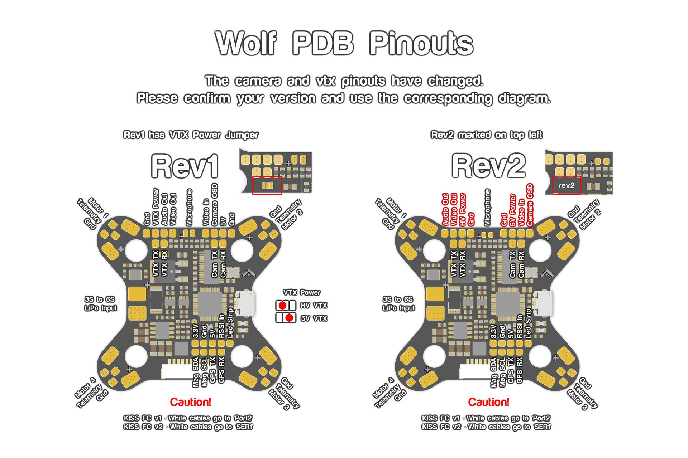
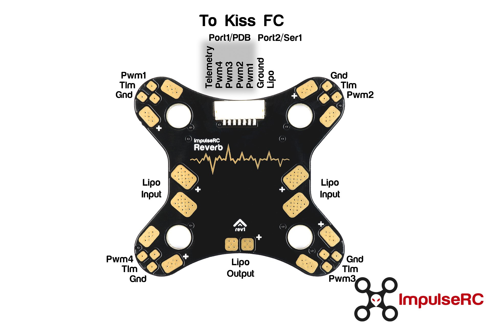
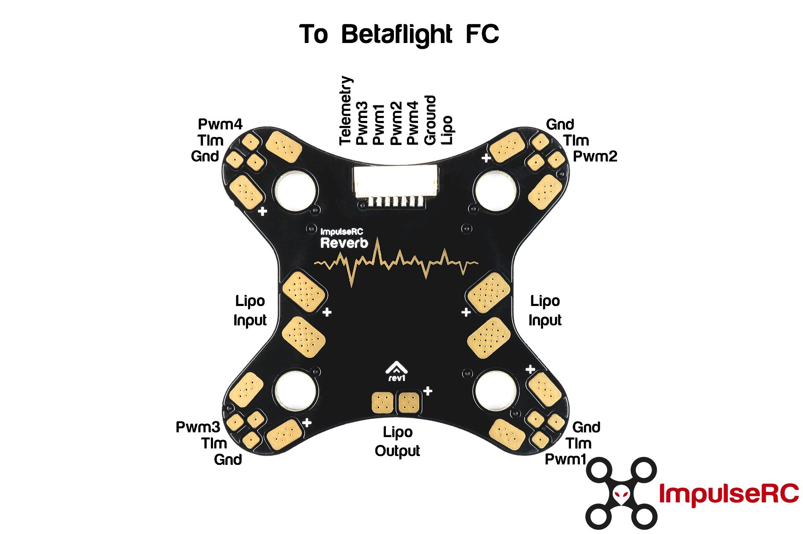

# Wiring Diagrams

Flight Controllers
- [Kiss v1](#kiss-v1)
- [Synergy F4](#Synergy-F4)
- [Helio v2](#helio-v2)
- [Diatone Mamba 20x20](#diatone-mamba-20x20)
- [BrainFPV Radix](#brainfpv-radix)
- [Omnibus F4 Nano v6](#omnibus-nano-f4-v6)

ESC
- [Hobbywing-45a](#hobbywing-45a)

PDB

- [Wolf PDB](#wolf-pdb)
- [Reverb PDB](#reverb-pdb)

VTX
- [TBS Unify HV](#tbs-unify-hv)
- [TBS Unify 5v](#tbs-unify-5v)
- [TBS Unify Race](#tbs-unify-race)
- [AKK Mach3](#akk-mach3)

Receiver
- [FrSky R9 Mini](#frsky-r9-mini)
- [FrSky R9 Slim+](#frsky-r9-slim)

GPS
- [M8N GLONASS GPS Module](#m8n-glonass-gps-module)

## Flight Controllers

### Kiss v1

_Top_

_Ports_

### Synergy F4

### Helio v2

### Diatone Mamba 20x20

### BrainFPV Radix

### Omnibus Nano F4 v6

## ESCs

### HobbyWing 45a 

## PDB

### Wolf PDB

### Reverb PDB

#### KISS

#### Betaflight

## VTX

### TBS Unify HV

### TBS Unify 5v

### TBS Unify Race

### AKK Mach3 

## Receivers

### FrSky R9 Mini

### FrSky R9 Slim+

## GPS

### M8N GLONASS GPS Module

