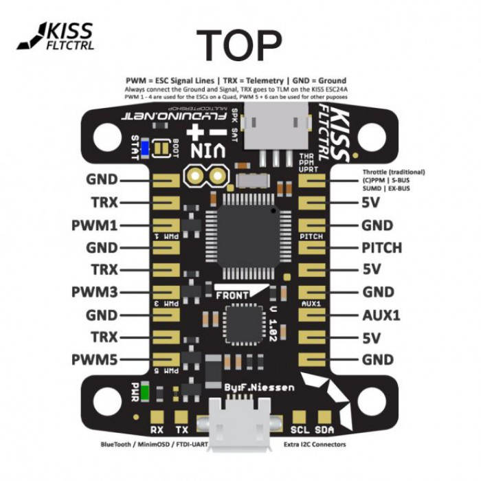
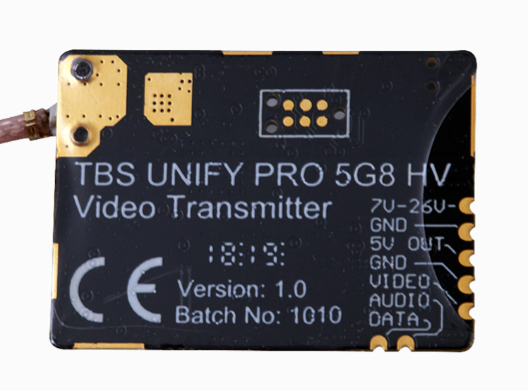
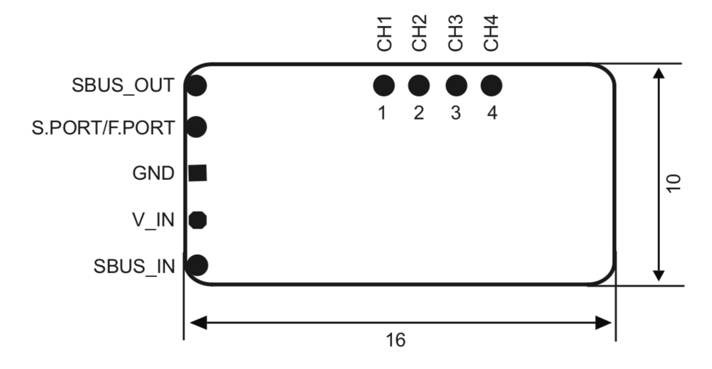

# Wiring Diagrams

### [Flight Controllers](#flight-controllers)
### [ESC](#ESCs)
### [PDB](#PDB)
### [VTX](#VTX)
### [Receiver](#Receivers)
### [GPS](#GPS)

## Flight Controllers

### Kiss v1

_Top_

_Ports_

### Synergy F4

_top_

_bottom_

### Helio v2

### Mamba (Find real name of stack)

### BrainFPV Radix

### Omnibus Nano F4 v6

## ESCs

### Spedix 30a (Blheli_S)

### HobbyWing 45a (Blheli 32)

## PDB

### Wolf PDB

## VTX

### TBS Unify HV

### TBS Unify 5v

### TBS Unify Race

### AKK Mach3 

## Receivers

### FrSky R9 Mini

### FrSky R9 Slim+

- []!(images/r9-slim+.png)

## GPS

### Ublox 8

